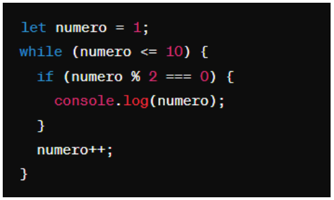
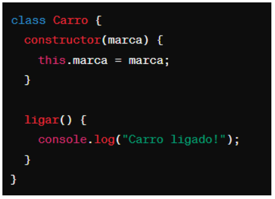

# Instruções
  - lembre-se de utilizar as estruturas de código como ``esta aqui com ` `` ou
```javascript
//esta aqui com ```
let a = "olá"
let b = 10
print(a)
```

# Questões objetivas

**1)** O que o código a seguir faz?



Escolha a opção que responde corretamente:

a) Imprime os números pares de 1 a 10.

b) Imprime os números ímpares de 1 a 10.

~~c)~~ Imprime os números pares de 2 a 10.

d) Imprime os números ímpares de 2 a 10.

______

**2)** Identificar a linha que falta no código para criar uma classe Veiculo com atributo marca, e uma classe Carro que herda de Veiculo com um método ligar(). 


No lugar onde está escrito “// linha” qual das opções abaixo deve estar para funcionar corretamente o código?

~~A)~~ let carro = new Carro("Toyota");

B) let ligar = new ligar("Toyota");

C) class Moto extends Veiculo {};

D) carro1.ligar();

______

**3)** Qual é o valor de resultado após a execução deste código?


Escolha a opção que responde corretamente:

~~A)~~ 18

B) 16

C) 14

D) 12

______

**4)** Como você criaria um método `acelerar()` em uma classe `Carro`, que recebe um parâmetro `velocidade` e o adiciona a um atributo `velocidadeAtual`?

~~A)~~ 

B) 

C) 

D) 

______

**5)** Qual a forma correta de definir uma classe Carro em JavaScript, com um método ligar() e um atributo marca?

~~A)~~ 

B) 

C) 

D) 

______

**6)** Observe o código abaixo:


Qual será a saída do código acima?

~~A)~~ "Olá, meu nome é João. Olá, meu nome é Maria."

B) "Olá, meu nome é ."

C) "João Maria"

D) "undefined undefined"

______

# Questões dissertativas

**7)** Vamos criar um programa em JavaScript para entender classes, métodos e atributos!
Classe Animal:
- Crie uma classe chamada Animal.
- Adicione dois atributos: nome e idade.
- Adicione um método chamado descrever() na classe Animal.
  - Este método deve exibir no console uma descrição do animal com seu nome e idade.

Criando e manipulando Animais:
- Crie dois objetos da classe Animal: um chamado "cachorro" e outro "gato", com idades distintas.
- Para cada animal, chame o método descrever() para ver a descrição no console.

Dica: Utilize `console.log()` para exibir as informações!

**Resposta:**

```javascript
// Criar uma classe chamada Animal
class Animal {
    // Construtor da classe Animal que recebe como atributos nome e idade
    constructor(nome , idade){
        this.nome = nome
        this.idade = idade
    }

    // Criação de um método chamado descrever o animal
    descrever() {
        // Printar no console uma mensagem com o nome e a idade do animal
        console.log(`A idade do animal é ${this.nome}, ele tem ${this.idade} anos`);
    }
}
    // Criar uma instância chamada cao dentro da classe Animal, naqual seu nome é "cachorro" e sua idade é 8
    let cao = new Animal ("cachorro", 8);
    // Chamar o método descrever da instância cao para printar a descrição do animal 
    cao.descrever();

    // Criar uma instância chamada gato dentro da classe Animal, naqual seu nome é "gato" e sua idade é 10
    let gato = new Animal ("gato", 10);
    // Chamar o método descrever da instância gato para printar a descrição do animal 
    gato.descrever();
```


______

**8)** Nos últimos dias tivemos a oportunidade de ter contato com Programação Orientada a Objetos, e tivemos contato com o tema "herança". Herança é um princípio de orientação a objetos, que permite que classes compartilhem atributos e métodos. Ela é usada na intenção de reaproveitar código ou comportamento generalizado ou especializar operações ou atributos. Então vamos praticar esse conteúdo nessa questão.
Vamos criar um programa em JavaScript para entender classes, métodos, atributos e herança!

Classe Animal:
- Crie uma classe chamada Animal.
- Adicione dois atributos: nome e idade.
- Adicione um método descrever() que exiba no console uma descrição do animal com seu nome e idade.

Classe Gato (Herda de Animal):
- Crie uma classe chamada Gato que herda da classe Animal.
- Adicione um atributo extra cor específico para gatos.
- Adicione um método miar() que exiba no console o som que um gato faz.

Criando Animais:
- Crie dois objetos da classe Animal: um chamado cachorro e outro gato, com idades distintas.
- Para o gato, também defina a cor.

Chamando os Métodos:
- Para cada animal, chame o método descrever() para ver a descrição no console.
- Para o gato, chame o método miar() para "ouvir" o som que ele faz (é também para ver o som no console).

Dica: Utilize console.log() para exibir as informações!


______

**9)** Vamos criar um programa em JavaScript para somar notas!

Classe SomadorDeNotas:
- Crie uma classe chamada SomadorDeNotas.
- Adicione um atributo total inicializado com 0 para armazenar a soma das notas.

Método adicionarNota:
- Adicione um método chamado adicionarNota(nota) na classe SomadorDeNotas.
- Este método deve receber um parâmetro nota e somá-lo ao atributo total.

Criando o Somador e Adicionando Notas:
- Crie um objeto da classe SomadorDeNotas, chamado somador.
- Utilize o método adicionarNota(nota) para adicionar algumas notas ao somador.

Chamando o Método para Ver o Total:
- Após adicionar todas as notas, chame um método verTotal() para exibir o total das notas adicionadas.

Dica: Utilize console.log() para exibir as informações!


______

**10)** Imagine que você está criando um programa em JavaScript para uma escola. Neste programa, existem diferentes tipos de funcionários, cada um com suas próprias características. Considere as seguintes classes:

Funcionário:
- atributo: Nome
- atributo: Idade
- atributo: Salário base
- método: calcularSalario() - Este método calcula o salário total do funcionário. Para cada tipo de funcionário, o cálculo será diferente.

Professor (herança de Funcionário):
- atributo: Disciplina
- atributo: Horas de aula por semana
- método: calcularSalario() - Para calcular o salário do professor, multiplicamos suas horas de aula pelo valor da hora/aula.

Agora, sua tarefa é escrever um código em JavaScript que crie as classes Funcionário e Professor, com suas características e métodos descritos acima. Depois de criar as classes, crie:
- Dois objetos do tipo Professor com informações fictícias.
- Para cada objeto, chame o método calcularSalario() e mostre o salário calculado no console.

Certifique-se de explicar cada parte do código utilizando comentários, explicando para que serve cada atributo e método, bem como a lógica por trás do cálculo de salário para o tipo de funcionário Professor.
